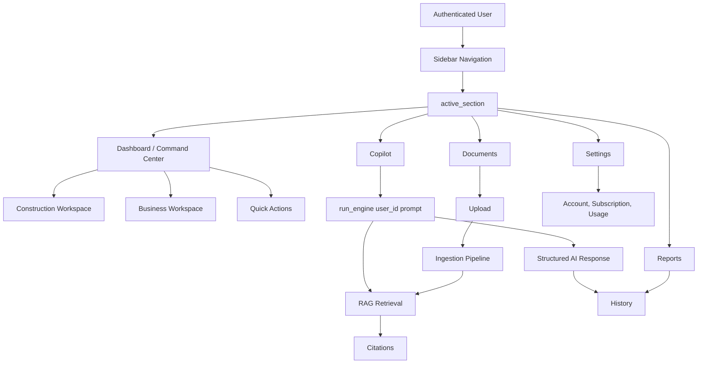

# Gao Intelligence Hub UI System

## Product Direction

Gao Intelligence Hub is an enterprise Construction + AI command center. The interface should feel intelligent, precise, industrial, and trustworthy. It should not feel like a startup landing page, gaming UI, cyberpunk UI, or animation showcase.

Primary influences: Scale AI, Linear, Stripe, Notion AI.

## Color System

| Token | Value | Usage |
| --- | --- | --- |
| Background | `#020617` | App shell, page background, blueprint grid base |
| Panel | `#0f172a` | Cards, hero panels, chat containers |
| Elevated | `#111c31` | Hover and raised surfaces |
| Accent | `#3b82f6` | Primary actions, focus, active states |
| Accent Strong | `#2563eb` | High emphasis buttons and borders |
| Secondary | `#64748b` | Metadata, muted labels |
| Title | `#f8fafc` | Page and card headings |
| Body | `#cbd5e1` | Main readable text |
| Muted Body | `#94a3b8` | Supporting copy |
| Border | `rgba(148, 163, 184, 0.18)` | Panel outlines |

Do not use neon palettes, excessive gradients, or high-saturation decorative effects.

## Typography

| Element | Rule |
| --- | --- |
| Hero title | `clamp(34px, 5vw, 64px)`, bold, tight line height |
| Page title | `clamp(24px, 5vw, 42px)` |
| Section title | `18px-22px`, bold |
| Body | `14px-16px`, high contrast |
| Metadata | `11px-12px`, uppercase only for operational labels |

Use `clamp()` for responsive type. Avoid viewport-only font sizing.

## Spacing

Use an 8px-based spacing system:

| Token | Value | Usage |
| --- | --- | --- |
| XS | `4px` | Dense inline spacing |
| SM | `8px` | Chips, small gaps |
| MD | `16px` | Card gaps, mobile padding |
| LG | `24px` | Section spacing |
| XL | `32px` | Hero and desktop panels |

Mobile sections use at least `16px` padding and `20px` vertical rhythm.

## Components

### Hero

The hero is a product command surface, not marketing decoration. It uses:

- Blueprint grid texture
- Structural line work
- Large title
- Short operational subtitle
- Data cells for system context

### Cards

Cards use:

- Background `#0f172a`
- Border `rgba(148, 163, 184, 0.18)`
- Radius `12px-18px`
- Subtle hover lift
- No nested card stacks unless the inner element is a repeated item

### Workspace Cards

Workspace cards represent functional domains such as NCC Compliance, Contracts, BIM Review, Strategy, or Financial Analysis. Each card needs:

- Title
- One-sentence operational description
- Short metadata label

### Copilot

Copilot is the center of the product.

Required behavior:

- Centered conversation
- User messages right aligned
- Assistant messages left aligned
- Markdown-like rendering for structured output
- Code blocks styled inside assistant bubbles
- Citation pills when retrieval context is available
- Typing indicator instead of a spinner
- Quick action chips for common construction workflows

### Tables

Wrap dense tables in horizontally scrollable containers where needed. Tables must never create page-level horizontal scrolling.

## Motion

Motion supports comprehension only.

Allowed:

- Fade and slide-up on page sections
- Card hover lift up to `3px`
- Subtle glow on focused or hovered enterprise surfaces
- Skeleton shimmer for loading states
- Typing indicator for Copilot

Avoid:

- Spinners for primary AI analysis states
- Particles
- Flashy loops
- Large parallax effects
- Excessive gradients

## Responsive Rules

Global rules:

- `html, body` use `overflow-x: hidden`
- `.block-container` uses full width with responsive padding
- All components use `width: 100%` and `max-width: 100%`
- No fixed content widths such as `600px`, `900px`, or `1200px`

Grid rules:

- Large desktop: 4 columns
- Tablet: 2 columns
- Mobile: 1 column

Mobile requirements:

- No horizontal scrolling
- Single-column cards
- Full-width buttons
- Responsive chat height
- Sidebar collapses through Streamlit's native mobile behavior

## Navigation

Navigation uses one state key only:

```python
st.session_state["active_section"]
```

`nav_selected` is UI-only and must not be manually mutated outside the selectbox sync point.

## Performance

Use:

- Cached subscription and user limit reads where appropriate
- Session state for chat history and page state
- Lazy rendering for detailed report output
- Minimal reruns after explicit user actions

Avoid:

- Rebuilding large static UI blocks in loops when a single HTML block is enough
- Running AI or ingestion work before a user submits an action
- Re-querying stores repeatedly in one render path

## Architecture


